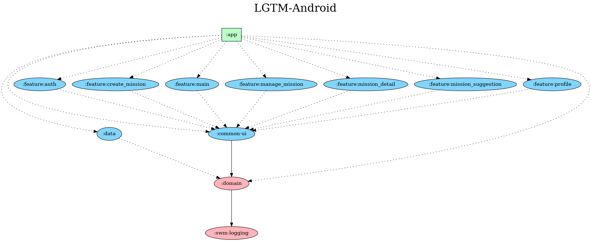

# 미션 기반 코드리뷰 매칭 플랫폼, LGTM

## 📌 Introduction

- [**LGTM이 궁금하시다면 Google Play로!**](https://play.google.com/store/apps/details?id=com.lgtm.android)

- 본 서비스는 SW마에스트로 14기 프로젝트입니다:)

|  |   |   |
| -- | -- | -- |
||   |  |

## ⚒️ Tech Stack

| Category            | Details                                      |
| ------------------- | -------------------------------------------- |
| Architecture        | MVVM, Multi Module, Clean Architecture, Hilt |
| AAC                 | Databinding, Livedata, ViewModel, Navigation |
| Concurrency         | Coroutine                                    |
| Third Party Library | OkHttp3, Retrofit2, Glide                    |
| CI/CD               | Github Actions                               |
| Language            | Kotlin(100%)                                 |

## ⛏️ Multi Module Architecutre

## ⛏️ Clean Architecutre

## 🖌️ Server Drivne UI

- **Home 화면의 경우, 앱 배포 없이 UI를 변경할 수 있는 `Server Driven UI`를 활용했습니다.**

- **도입 이유**

  - 안드로이드 앱은 유저의 앱 업데이트를 강제하기 어려워서 유연한 변경사항 제공이 어렵다.
  - 새로운 기능 & 수정사항을 모두에게 빠르게 반영하지 못한다.
  - 클라이언트 코드 변경 없이 UI를 조정가능.

- **개괄적인 방식**

  1. 클라이언트-백엔드 ViewType 정의 및 Json 설계

  2. 서버가 API 응답에 UI 정보를 담아 클라이언트에 제공

  3. 안드로이드에서는 동적으로 ViewType을 보고 홈화면의 UI 구성

- **Response 설계**

  

- **안드로이드 구현**

  

## 🖼️ 구현 화면

| 화면 분류          | 이미지                                                       |
| ------------------ | ------------------------------------------------------------ |
| 로그인 / 회원가입  |  |
| 홈화면           |  |
| 미션 조회 (리뷰어) |  |
| 미션 조회 (리뷰이) |  |

 
